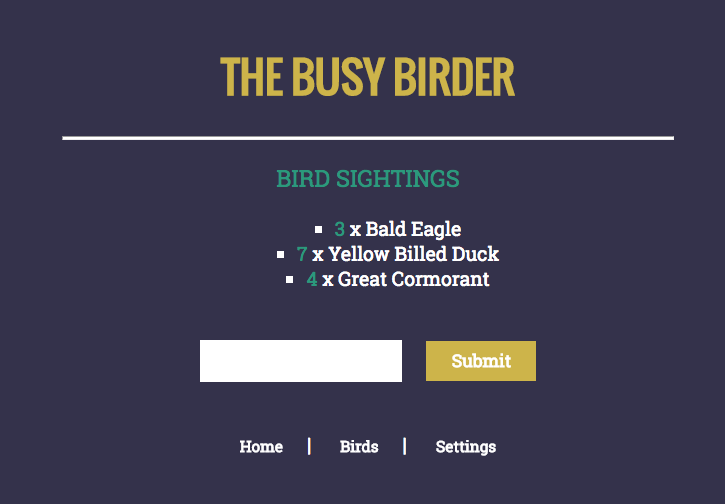
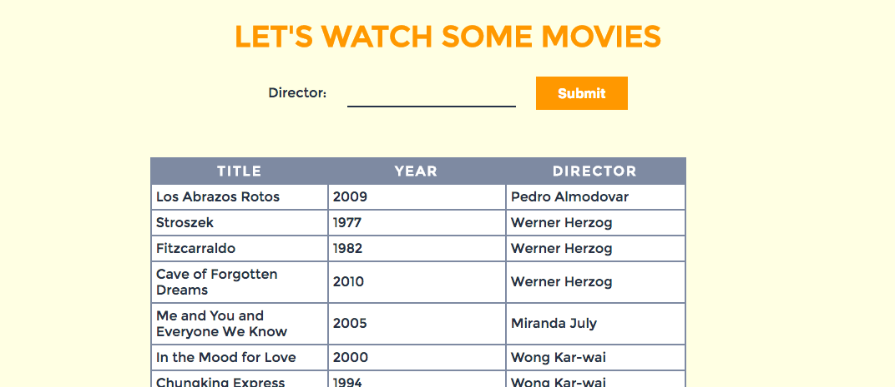
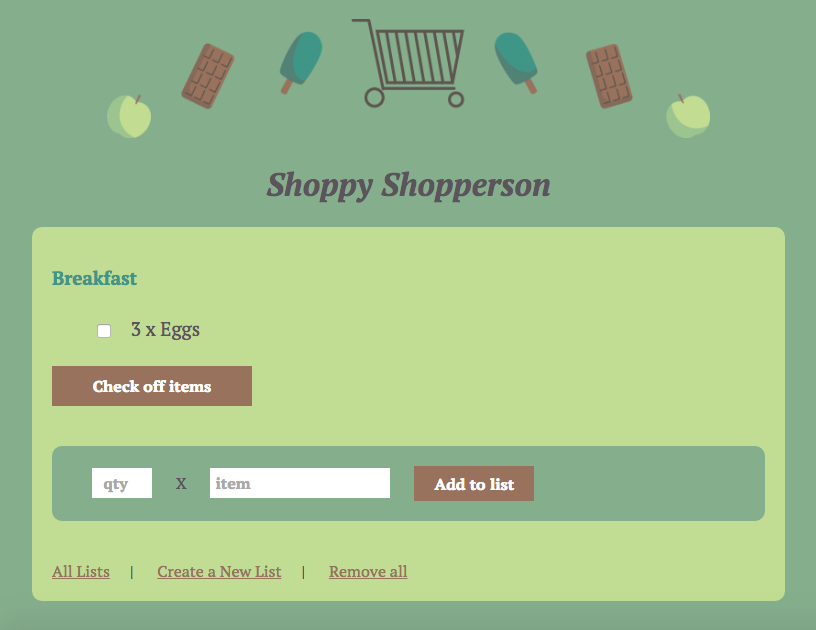
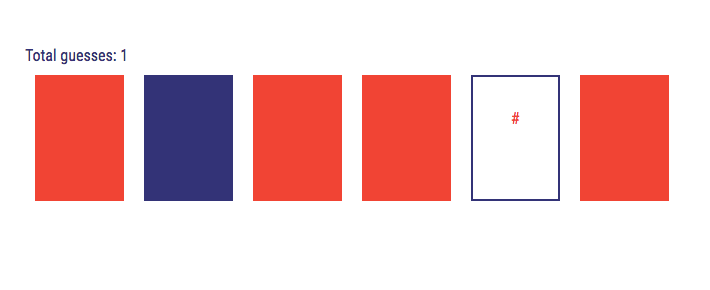

# ait-fullstack-projects
Projects for Applied Internet Technology (a fullstack development course), Fall 2015. Topics included Javascript, server-side programming with Node and Express, client-side programming with Javascript and Handlebars framework, database design with a NoSQL database (MongoDB) and development tools. Instructions for running locally are provided below. Check out the final project for this class in the [ait-final-project](https://github.com/kcp288/ait-final-project) repo. 

### homework01 - Basic Javascript I: Blackjack App
Beginning Javascript project. Implementation of a basic commandline blackjack app.

Uses the `readline-sync` module.

### homework03 - Basic Javascript II: JSON Basketball 
Grabs JSON data from NBA games and calculates player data using Javascript higher order functions.

Uses the `requests` module.

### homework03 - Express Movies App
Implementation of a basic HTTP server that displays static files, in this case two images on two routes. 

Also implementation of a basic Express app with the Handlebars templating engine.

### homework04 - The Busy Birder
This app allows the user to store the birds they have sighted! Concepts included serving static files, using middleware, handling GET/POST forms and integrating sessions.

Run locally using `npm install --save`, running `node app.js` and then opening `localhost:3000` in your browser.

### homework05 - Let's Watch Some Movies!
This MoviesDB uses the commandline mongodb client to create a database, collection and several documents to store movies! It also uses the mongoose node module to read and write data to mongodb.

Run locally using `npm install --save`, running `node app.js` and then opening `localhost:3000/movies` in your browser.

### homework06 - Shoppy Shopperson
This app built on the work with mongodb and included creating schemae, adding slugs to the schema and extracting parameters from a URL path. The app allows the user to create grocery lists, check items of lists, and save multiple lists.

Run locally using `npm install --save`, running `node bin/www` and then opening `localhost:3000` in your browser.

### homework07 - DOM Manipulation “Matchicode”
The focus of this project was manipulating the DOM, setting element attributes and handling events. Result, a fun card matching game! 

To play, just open `base.html` in the browser.

